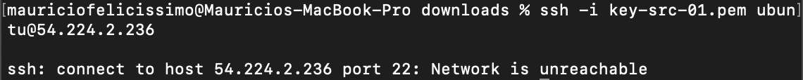

# PonderadaAWS

# RELATORIO TÉCNICO SOBRE ACESSO SSH NO EC2

# INTRODUÇÃO
Neste trabalho vou apresentar um relatorio técnico que registre o meu trabalho que fiz ao realizar o tutorial de criar uma instância de máquina EC2 na AWS e acessar esta máquina com SSH. Foi sugerido no trabalho que nós utilizemos a ferramenta PUTTY, mas depois de muitas tentativas fracasadas, acredito eu que por estar em um mac, eu decidi não seguir a sugestão, e optei por acessar o SSH via o terminal do computador. 

# OBJETIVO
O objetivo deste trabalho é de aprender a criar uma instancia de máquina EC2 na AWS, e acessae esta instancia com SSH. Este relatorio tecnico será dividido em 6 partes: Introdução; Objetivo; Método; Resultados; Conclusão.

# MATERIAIS
Os materiais necessarios para completar este trabalho são: AWS com uma conta pessoal registrada; Terminal; Internet; Git; Github.

# METODO
Para realizar esta tarefa, eu começei acessando o AWS academy e clicando no botão 'Start Lab', dentro do laboratorio de aprendizagem. Ao fazer isso a minha tela ficou assim:

Depois, cliquei no botão com o circulo verde, escrito 'AWS'. Isso me levou ao AWS, onde podia pesquisar por EC2 para iniciar a minha instancia.

Na barra de pesquisa escrevi "EC2", e cliquei na primeira opção. 

Dentro do "EC2" apareceram todas estas opções. Em seguida, apertei no botão "Launch Instance" para iniciar uma instancia.

Aqui preenchi toda a informação para criar a minha instancia. Dei o nome da instancia, escolhi o tipo de instancia, crei um par de chaves, etc. 

Ao confirmar, recebí esta notificação dizendo que a instancia foi lançada com sucesso.

Estas são as informações da instancia criada

Assim que a instancia foi lançada, era hora de acessar ela usando o SSH na terminal do computador. Começei acessando a minha pasta de downloads, onde estaria o meu par de chaves criado.

Aqui usei o comando sudo chmod 600 {nome da minha chave}

# RESULTADOS
Logo depois, ao tentar acessar usando a linha de comando ssh -i key-src-01.pem ubuntu@54.224.2.236, este IP sendo o IP publico da minha instancia, me deparei com a seguinte mensagem:

Após diversas tentativas, vi que eu apenas não estava conseguindo acessar a minha instancia. Este final de semana não estou ficando em casa, e estou tendo que fazer tudo atraves do 4G do meu celular, e então eu acredito que é por isso que eu não consegui completar a tarefa. Vou subir o trabalho assim apenas para não perder o prazo de entrega, mas não consegui acessar a minha instancia. 

# CONCLUSÃO
Em conclusão, por mais que eu tenha conseguido lançar a minha instancia no AWS, eu não consegui acessar ela usando o SSH no terminal do meu computador. Pretendo tirar as minhas duvidas com o professor e pedir ajuda. 
